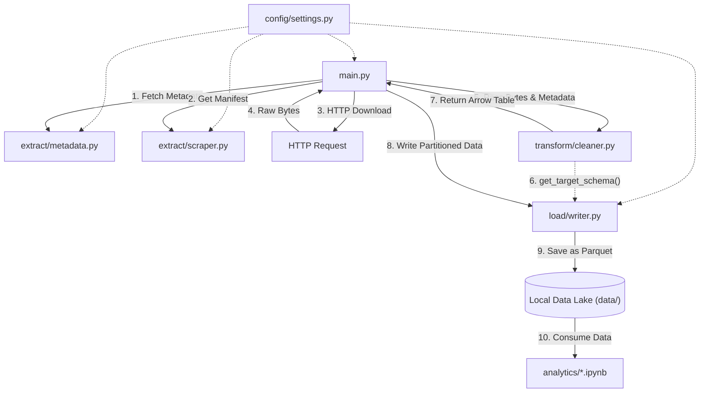

# src overview

## Table of Contents
1. [Module Overview](#module-overview)
2. [Script Interactions](#script-interactions)

## Module Overview

### `main.py`
The application entry point. It orchestrates the pipeline execution by sequentially calling extraction modules and managing a thread pool for concurrent data processing. It delegates transformations and storage operations to specialized modules.

### `config/settings.py`
The configuration module. It centrally defines system parameters such as endpoints, directory paths, worker counts, and network timeouts. All other modules import these constants to ensure central configuration management.

### `extract/metadata.py`
Fetches and parses the station metadata manifest. It extracts structural information such as geographic coordinates, station names, and regions, returning a structured dictionary utilized for data enrichment.

### `extract/scraper.py`
Responsible for analyzing the data directory structure. It retrieves the index page of the data source and uses regular expressions to build a manifest mapping station identifiers to historical archive filenames.

### `transform/cleaner.py`
Processes the raw binary archives. It decompresses the payload in memory, normalizes column names, enforces strict typing, handles missing data, and enriches the dataset with metadata. It outputs an Apache Arrow table.

### `load/writer.py`
Manages data persistence. It takes the Apache Arrow table and writes the records to the file system as Parquet files, applying a Hive-style partition strategy based on geographic regions.

## Script Interactions

